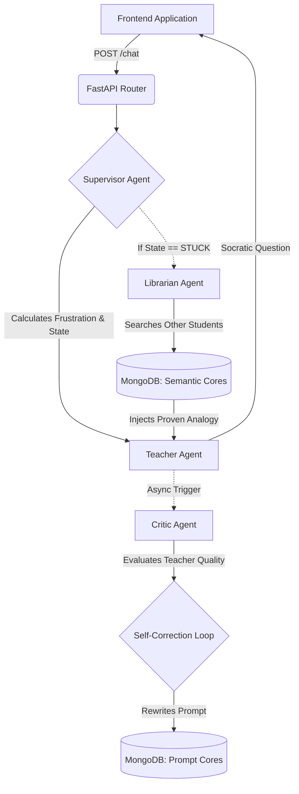

'''

# FEHM.AI

[](https://www.python.org/)
[](https://fastapi.tiangolo.com/)
[](https://docs.celeryq.dev/)
[](https://www.mongodb.com/)
[](https://opensource.org/licenses/MIT)

**Headless Multi-Agent Pedagogical Framework for EdTech**

FEHM.AI is an autonomous Socratic cognitive engine designed to replace "answer-giving" AI tutors with a distributed swarm of specialized teaching agents. The system prioritizes cognitive friction over instant gratification, using affective computing to dynamically adapt teaching strategies based on real-time student emotional states.

## The Problem

Current AI integrations in education act as glorified answer keys. When a student is stuck, the AI provides the solution. This creates **cognitive offloading**—students learn to prompt rather than to think. FEHM.AI reverses this by enforcing Socratic methodology through an autonomous agent architecture.

## Architecture

The system implements a 4-layer agent swarm communicating via Redis and Celery:



### Agent Responsibilities

- **Supervisor (Affective Layer)**: Analyzes sentiment, calculates frustration index (0.0-1.0), determines cognitive state (`LEARNING`, `STUCK`, `MASTERY`)
- **Teacher (Execution Layer)**: Socratic mentor with dynamic personality switching. Enforces One Question Rule, refuses code dumps
- **Critic (Self-Correction Layer)**: Asynchronously grades teaching quality, autonomously rewrites prompts when pedagogical failures detected
- **Librarian (Generalization Layer)**: Cross-student pattern matcher. Retrieves analogies that successfully unblocked similar students

## Tech Stack

- **API**: FastAPI (async, OpenAPI documentation)
- **Task Queue**: Celery with Redis broker
- **Database**: MongoDB Atlas (semantic cores, prompt evolution, chat logs)
- **Containerization**: Docker & Docker Compose
- **LLM**: Google Gemini (swappable to OpenAI/Anthropic)

## 📸 User Interface Preview

### 1. Socratic Entry Gateway

Authentication interface utilizing secure session management and cognitive entry gates.


### 2. Socratic Chat Workspace

The live agent execution environment featuring transparent rendering of internal strategy, emotional validation tracking, and active parallel sandbox prompts.


### 3. Mastery Center Dashboard

Comprehensive cognitive progression mapping, diagnostic analytics ledgers, and score distribution tracking across discrete learning sessions.


## Quick Start

graph TD
A[socratic-frontend] -->|POST /chat| B(FastAPI Router: Socractic)
B --> C{Supervisor Agent}

    C -->|Calculates Frustration & State| D[Teacher Agent]
    D -->|Socratic Question Output| A

    D -.->|Async Quality Gating| E[Critic Agent]
    E -->|Evaluates Teacher Quality| F{Self-Correction Loop}
    F -->|Rewrites Prompt Template| G[(MongoDB: Prompt Cores)]

    C -.->|If State == STUCK| H[Librarian Agent]
    H -->|Cross-Student Semantic Search| I[(MongoDB: Semantic Cores)]
    I -->|Injects Validated Analogy Context| D

### Prerequisites

- Docker 20.10+
- MongoDB Atlas cluster (or local MongoDB 6.0+)
- Gemini API key

### Installation

```bash
# Clone repository
git clone https://github.com/taha463/fehm-ai-engine.git
cd fehm-ai-engine

# Configure environment
cp .env.example .env
# Edit .env with your MONGO_URI and GEMINI_API_KEY

# Start services
docker-compose up --build
```

The API will be available at `http://localhost:8000`

## API Reference

### POST /chat

Main interaction endpoint.

**Request:**

```bash
curl -X POST "http://localhost:8000/chat" \
  -H "Content-Type: application/json" \
  -d '{
    "student_name": "Taha",
    "user_input": "I give up, I dont get how recursion works.",
    "chat_history": []
  }'
```

**Response:**

```json
{
  "sender": "Teacher",
  "message": "It is completely normal to feel stuck here; recursion twists everyone's brain at first. Let's step away from the code for a second. If you were standing in a line of 100 people and wanted to know your exact position, but you could only ask the person directly in front of you, what would you ask them?",
  "thought": "Student frustration is high (0.8). Supervisor activated EMPATHETIC mode. I need to acknowledge the frustration, drop the technical jargon, and use a Parallel Sandbox analogy.",
  "state": "STUCK",
  "personality_mode": "EMPATHETIC"
}
```

## Project Structure

```
fehm-ai/
├── main.py                 # FastAPI application entry point
├── worker.py              # Celery worker configuration
├── agents.py              # Agent orchestration and logic
├── ai_core.py             # LLM abstraction layer
├── requirements.txt       # Python dependencies
├── Dockerfile            # Container definition
├── docker-compose.yml    # Multi-service orchestration
└── .env.example          # Environment template
```

## Development

```bash
# Run tests
docker-compose exec api pytest

# View logs
docker-compose logs -f api

# Restart workers
docker-compose restart celery
```

## Environment Variables

| Variable         | Description               | Required                           |
| ---------------- | ------------------------- | ---------------------------------- |
| `MONGO_URI`      | MongoDB connection string | Yes                                |
| `GEMINI_API_KEY` | Google Gemini API key     | Yes                                |
| `REDIS_URL`      | Redis connection URL      | No (default: redis://redis:6379/0) |
| `LOG_LEVEL`      | Logging level             | No (default: INFO)                 |

## Contributing

1. Fork the repository
2. Create feature branch (`git checkout -b feature/amazing-feature`)
3. Commit changes (`git commit -m 'Add amazing feature'`)
4. Push to branch (`git push origin feature/amazing-feature`)
5. Open Pull Request

Please read [CONTRIBUTING.md](CONTRIBUTING.md) for code standards and agent persona guidelines.

## License

Distributed under the MIT License. See `LICENSE` for more information.

---

**Built with:** Logic, friction, and the pursuit of mastery.

```

```
